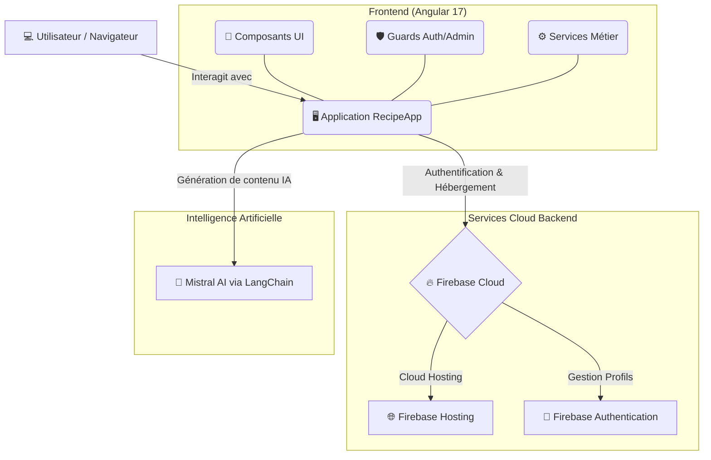

<div align="center">
  <h1>🍽️ RecipeApp</h1>
  <p>Une application web moderne, intelligente et sécurisée de découverte culinaire.</p>

  <!-- Badges -->
  
  
  
  
  
</div>

<hr/>

## 🎯 À propos du projet

**RecipeApp** est une plateforme complète dédiée à la gastronomie et aux recettes. Construite autour du puissant framework **Angular 17**, elle permet aux utilisateurs de parcourir, rechercher, et sauvegarder leurs recettes favorites. L'application se distingue par son intégration poussée avec **Firebase** pour la sécurité (Auth) et par l'utilisation de **Mistral AI** via LangChain pour offrir une expérience enrichie (assistants intelligents, recommandations).

---

## 🏗️ Architecture du Système

Le schéma ci-dessous illustre comment les différents composants du projet interagissent pour fournir une expérience utilisateur fluide, de l'interface client jusqu'aux services cloud et à l'Intelligence Artificielle.



---

## ✨ Fonctionnalités Principales

* 🔒 **Authentification Complète** : Inscription, connexion et mot de passe oublié sécurisés par **Firebase Auth**.
* 🔍 **Exploration & Recherche Avancée** :
  * Filtrage précis par **Catégories**, **Pays/Régions** et **Ingrédients**.
  * Filtre croisé multi-ingrédients.
  * Fiches détaillées pour chaque recette (mesures, instructions étape par étape).
* 👤 **Espace Personnel** :
  * Sauvegarde rapide de recettes dans les favoris ❤️.
  * Suivi complet de votre historique de repas 📜.
* 🛡️ **Périmètre Administrateur** : Tableau de bord sécurisé par `@AdminGuard` pour la gestion avancée.
* 🤖 **Intelligence Artificielle** : Des fonctionnalités dopées à l'IA avec le modèle Mistral pour affiner vos recherches ou trouver de l'inspiration culinaire.

---

## 📂 Structure Détaillée du Code

Voici l'organisation du code source au sein du dossier `src/app/`. Cette architecture modulaire facilite la maintenance et l'évolution de l'application.

```bash
📦 src/app/
 ┣ 📂 admin/                   # Tableau de bord administrateur (Protégé)
 ┣ 📂 components/              # 🧩 Vues et composants réutilisables
 ┃ ┣ 📂 login/                 # Page de connexion
 ┃ ┣ 📂 signup/                # Création de compte
 ┃ ┣ 📂 dashboard/             # Écran d'accueil principal
 ┃ ┣ 📂 meal-details/          # Fiche détaillée d'une recette
 ┃ ┣ 📂 favorites/             # Liste des recettes favorites de l'utilisateur
 ┃ ┗ ...                       # (Autres filtres: areas, categories, etc.)
 ┣ 📂 core/                    # 🛡️ Cœur de la sécurité (Guards)
 ┃ ┣ 📜 admin.guard.ts         # Vérifie les droits d'administration
 ┃ ┗ 📜 auth.guard.ts          # Protège les pages privées (ex: Profil, Favoris)
 ┣ 📂 models/                  # 📐 Interfaces TypeScript (Typage strict des données)
 ┣ 📂 services/                # ⚙️ Logique applicative et requêtes externes
 ┃ ┣ 📜 ia/                    # Configuration et requêtes vers Mistral AI
 ┃ ┣ 📜 meal.service.ts        # Appels aux API de repas/recettes externes
 ┃ ┗ 📜 auth.service.ts        # Communication avec Firebase Authentication
 ┣ 📜 app-routing.module.ts    # Routage global (URL vers Composants)
 ┗ 📜 app.module.ts            # Déclaration globale des modules Angular
```

---

## 🚀 Installation & Lancement en local

### 1. Prérequis
Assurez-vous d'avoir installé :
- [Node.js](https://nodejs.org/) (version LTS recommandée)
- Angular CLI (`npm install -g @angular/cli`)

### 2. Cloner et Installer
```bash
git clone https://github.com/VOTRE_NOM/RecipeApp.git
cd RecipeApp
npm install
```

### 3. Configuration de la Sécurité (Variables d'environnement)
Pour éviter la fuite de clés d'API (Firebase, Mistral AI), celles-ci sont ignorées par `.gitignore`.
1. Allez dans le dossier `src/environments/`.
2. Renommez le fichier modèle `environment.example.ts` en `environment.ts` **et** créez-en une copie nommée `environment.development.ts`.
3. Éditez ces fichiers avec vos identifiants privés :

```typescript
export const environment = {
  production: false,
  firebaseConfig: {
    projectId: "VOTRE_PROJECT_ID",
    appId: "VOTRE_APP_ID",
    storageBucket: "...",
    apiKey: "VOTRE_FIREBASE_API_KEY",
    // ...
  },
  mistral: {
    apiKey: "VOTRE_CLE_API_MISTRAL"
  }
};
```

### 4. Démarrer le projet
Exécutez la commande suivante pour démarrer le serveur de développement :
```bash
ng serve
```
Ouvrez ensuite votre navigateur sur [http://localhost:4200/](http://localhost:4200/). L'application se rafraîchira automatiquement lors de vos prochaines modifications de code.

---

## 📦 Compilation et Déploiement

Pour générer une version de production optimisée :
```bash
npm run build
```
*(Le code compilé se trouvera dans le dossier `dist/recipe-app/`)*

**Déployer sur Firebase Hosting :**
Assurez-vous d'avoir installé le CLI Firebase et de vous être connecté (`firebase login`), puis lancez :
```bash
firebase deploy --only hosting
```

---
<div align="center">
  <i>Développé avec passion 🔥 dans le cadre du projet RecipeApp.</i>
</div>
